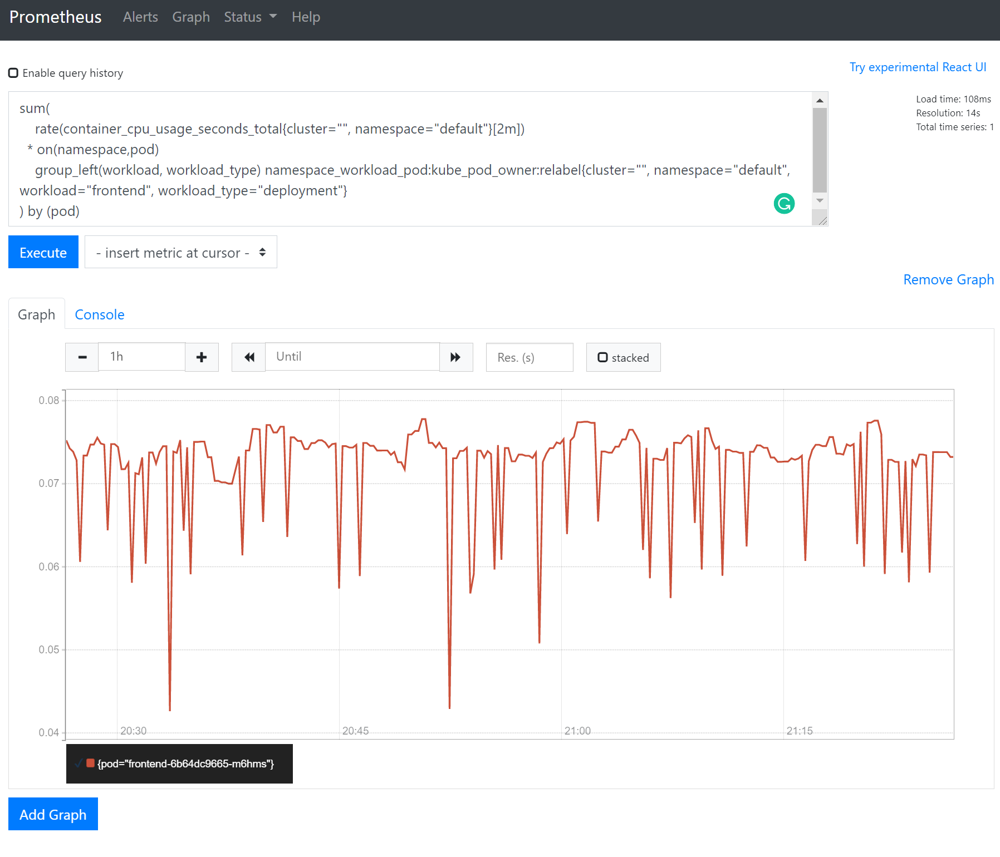

# Interacting With The Monitoring Stack

In this section, we will learn to run some queries on Prometheus to get some of the monitoring
data about our deployment. You can run the following queries in the Prometheus ui
which can be accessed on `http://MASTER_IP:9090`. You can check [this tutorial](https://opensource.com/article/19/11/introduction-monitoring-prometheus)
and [the official docs](https://prometheus.io/docs/prometheus/latest/querying/basics/)
for an introduction to PromQL, the querying language used by Prometheus.

**Table of Contents**
- TOC
{:toc}

## Get a List of Deployments

You will need to perform autoscaling actions on several microservices and `deployment` on our deployed application.
To get a list of deployments in our cluster, you can run the following command on the master node:

```console
$ kubectl get deploy
NAME                    READY   UP-TO-DATE   AVAILABLE   AGE
redis-cart              1/1     1            1           107m
shippingservice         1/1     1            1           107m
paymentservice          1/1     1            1           107m
productcatalogservice   1/1     1            1           107m
emailservice            1/1     1            1           107m
checkoutservice         1/1     1            1           107m
recommendationservice   1/1     1            1           107m
currencyservice         1/1     1            1           107m
frontend                1/1     1            1           107m
cartservice             1/1     1            1           107m
adservice               1/1     1            1           107m
loadgenerator           1/1     1            1           107m
```

Many queries in this section will query specific information about a single deployment, but you can query similar information
about other deployments by change the name of deployment.

## Prometheus Client Libraries

The queries listed in this section are example of what is possible using Prometheus. You can automate any of
these queries using the [prometheus client library](https://prometheus.io/docs/instrumenting/clientlibs/)
for your language of choice. You may also look at a list of metrics available on prometheus to see what other
metrics are available to you.

## Get Pod Count For All Deployments

You can use the following to query a list of pods running in all deployments using:

```promql
count(kube_pod_info{namespace="default"}) by (created_by_kind,created_by_name)
```

The result would be similar to the following (we manually scaled `frontend` to 3 for this example):

```
{created_by_kind="ReplicaSet",created_by_name="adservice-5f6f7c76f5"}	1
{created_by_kind="ReplicaSet",created_by_name="checkoutservice-85d4b74f95"}	1
{created_by_kind="ReplicaSet",created_by_name="currencyservice-6d7f8fc9fc"}	1
{created_by_kind="ReplicaSet",created_by_name="paymentservice-98cb47fff"}	1
{created_by_kind="ReplicaSet",created_by_name="redis-cart-74594bd569"}	1
{created_by_kind="DaemonSet",created_by_name="svclb-frontend-external"}	2
{created_by_kind="ReplicaSet",created_by_name="frontend-6b64dc9665"}	3
{created_by_kind="ReplicaSet",created_by_name="loadgenerator-68854444b4"}	1
{created_by_kind="DaemonSet",created_by_name="svclb-loadgenerator"}	2
{created_by_kind="ReplicaSet",created_by_name="cartservice-675b6659c8"}	1
{created_by_kind="ReplicaSet",created_by_name="emailservice-798f4f5575"}	1
{created_by_kind="ReplicaSet",created_by_name="productcatalogservice-7f857c47f"}	1
{created_by_kind="ReplicaSet",created_by_name="recommendationservice-5bf5bcbbdf"}	1
{created_by_kind="ReplicaSet",created_by_name="shippingservice-75f7f9dc6c"}	1
```

The `created_by_name` returned always starts with the name of the deployment. You can
use this to automate this process. To manually change the number of pods running
a specific service, you can use the following command:

```sh
kubectl scale --replicas=3 deploy/frontend
```

## Get The CPU Usage of Pods

To get the CPU usage for pods running in a `deployment` called `frontend` (for each pod):

```promql
sum(
    irate(container_cpu_usage_seconds_total{cluster="", namespace="default"}[2m])
  * on(namespace,pod)
    group_left(workload, workload_type) namespace_workload_pod:kube_pod_owner:relabel{cluster="", namespace="default", workload="frontend", workload_type="deployment"}
) by (pod)
```

You can also see the result of this query in time going to the `graph` tab:

[](./img/prometheus-01.png)

## Get The Memory Usage of Pods

To get the memory usage for pods running in a `deployment` called `frontend` (for each pod):

```promql
sum(
    (container_memory_usage_bytes{cluster="", namespace="default"})
  * on(namespace,pod)
    group_left(workload, workload_type) namespace_workload_pod:kube_pod_owner:relabel{cluster="", namespace="default", workload="frontend", workload_type="deployment"}
) by (pod)
```

## Get CPU Usage of All Deployments

To get the total CPU usage of all `deployments` in the namespace `default`, we can use the following query.
Note that `irate` fetches the latest result, if you want the average cpu usage in the specified period,
you need to use `rate` function. Check [PromQL documentation](https://prometheus.io/docs/prometheus/latest/querying/functions/)
for more details.

```promql
sum(
  irate(container_cpu_usage_seconds_total{cluster="", namespace="default"}[2m])
* on(namespace,pod)
  group_left(workload, workload_type) namespace_workload_pod:kube_pod_owner:relabel{cluster="", namespace="default", workload_type="deployment"}
) by (workload, workload_type)
```

`Note:` This query returns the total CPU usage for each deployment, not the CPU usage per pod.

The graph for this query would be similar to the following image:

[](./img/prometheus-02.png)

## Get Memory Usage of All Deployments

To get the total memory usage of all `deployments` in the namespace `default`:

```promql
sum(
  (container_memory_usage_bytes{cluster="", namespace="default"})
* on(namespace,pod)
  group_left(workload, workload_type) namespace_workload_pod:kube_pod_owner:relabel{cluster="", namespace="default"}
) by (workload, workload_type)
```

`Note:` This query returns the total memory usage for each deployment, not the memory usage per pod.

## Wrap Up and Next Steps

Now that you have achieved a better understanding of the monitoring stack on our
cluster, you may proceed to our [next step where we talk about the Kubernetes API](07-kubernetes-api.md).
